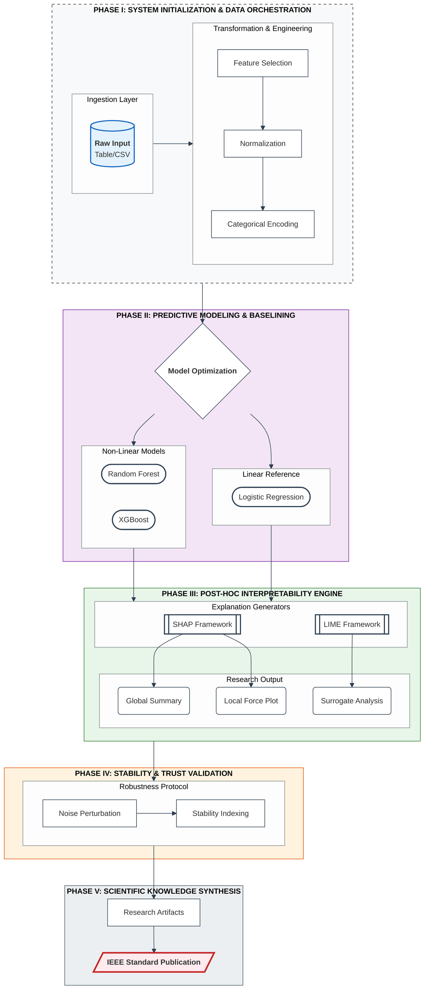

# IEEE Research-Grade Prototype Architecture

This document contains the high-fidelity conceptual schematic for the Explainable AI (XAI) framework, optimized for academic publication and research rigor.

## Architecture Diagram

